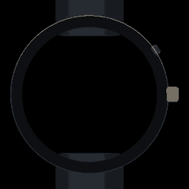

# Hey Jarvis

An intelligent voice assistant for home automation, powered by AI agents and custom voice hardware.


## Jarvis, summoned

Hold the power button on the phone and Jarvis comes up over whatever you were doing; on the watch he is the whole screen. Here he is at rest, then speaking, then working through something, and then gone.

<p align="center">
  <picture>
    <source srcset="./docs/jarvis-on-a-phone.webp" type="image/webp" />
    
  </picture>
  &nbsp;&nbsp;
  <picture>
    <source srcset="./docs/jarvis-on-a-watch.webp" type="image/webp" />
    
  </picture>
</p>

One sphere, drawn once. Both devices bundle the same [`hologram`](./hologram) package, which is why there is no version of him that is only on the phone. These clips are that same drawing rendered frame by frame at 1300 particles — more than any phone is asked for, since nothing offline has to hold sixty frames a second — by [`hologram/.scripts/render-showcase.ts`](./hologram/.scripts/render-showcase.ts):

```bash
bun hologram/.scripts/render-showcase.ts
```

Those are animated WebP at a true 60 fps, with a 30 fps GIF behind them for anything that will not animate one — **a README cannot show a video**, because GitHub renders neither a `<video>` element from a file in a repository nor a video served from `raw`. The full-size VP9 copies are here to download: [phone](./docs/jarvis-on-a-phone.webm), [watch](./docs/jarvis-on-a-watch.webm).

All three are transparent outside the device, so they sit on a light page as happily as a dark one.

The picture at the top is the same drawing again: one still, mid-sentence, at the full 3000 particles — the most a phone is ever *allowed*, and more than one has ever been measured drawing. It is 1280×640, which is what GitHub wants for a repository's social preview, so the same file serves as both.

The devices are real frames rather than drawings: Google's own Pixel 10 Pro device art, and a community vector of a Pixel Watch 3 — Google publishes art for every Pixel phone and none for its watch. [`hologram/.scripts/device-art/NOTICE.md`](./hologram/.scripts/device-art/NOTICE.md) says where each came from and under what licence, **including that the two watch clips are themselves CC BY-SA 4.0** because the frame in them is.

## Architecture

```
ESP32 Voice Hardware  ←→  Home Assistant  ←→  MCP Server (Mastra AI)  ←→  ElevenLabs Voice
```

## Projects

| Project | Description |
|---------|-------------|
| [**mcp**](./mcp) | Mastra AI-powered MCP server with 15+ agents across 16 domains (weather, shopping, IoT, calendar, etc.) |
| [**elevenlabs**](./elevenlabs) | CLI for deploying and testing the ElevenLabs voice agent |
| [**home-assistant-voice-firmware**](./home-assistant-voice-firmware) | ESPHome firmware for ESP32 voice devices with ElevenLabs streaming |
| [**mobile**](./mobile) | Expo app that registers as the phone's default assistant, so the power button summons Jarvis |
| [**watch**](./watch) | The same thing on a Wear OS watch |
| [**hologram**](./hologram) | The sphere itself, and the voice tracking behind it — platform-free, and bundled by both apps |

Getting the app onto a phone and a paired watch goes through Google Play — internal testing on every pull request, production on every release cut from `main`: [**docs/play-store.md**](./docs/play-store.md) covers the upload key, the publisher account and the secrets each needs. The signing and the workflow are in place; what is not is an open Play developer account, which is where that document starts.

## Quick Start

Open in a DevContainer — all dependencies are pre-installed.

```bash
bunx turbo serve --filter=mcp                              # Start MCP server + playground
bunx turbo deploy --filter=elevenlabs                       # Deploy voice agent
bunx turbo serve --filter=home-assistant-voice-firmware     # Flash firmware over WiFi
```

## Development

- **Build system**: Turborepo monorepo
- **Package manager**: Bun
- **Code quality**: Biome (formatting + linting), TypeScript strict mode
- **Commits**: Conventional Commits enforced via commitlint in a git hook
- **Secrets**: 1Password CLI — Turborepo tasks inject credentials via `op run`
- **CI/CD**: GitHub Actions with DevContainer, Release Please for versioning
- **Supply chain**: Bun-only installs, exact version pins, a 7-day release cooldown, no dependency install scripts, SHA-pinned Actions — see [AGENTS.md](./AGENTS.md#supply-chain-security)

```bash
bunx turbo test              # Mocked tests — no credentials needed
bunx turbo test:integration  # The tests that call real services
bunx turbo lint              # Lint everything
bunx biome check --write .   # Format + lint
```

CI runs `turbo test` on every push. `turbo test:integration` waits until the
pull request is marked ready for review, and then runs on every push after that.

Each project has an `AGENTS.md` with detailed development guidelines.
